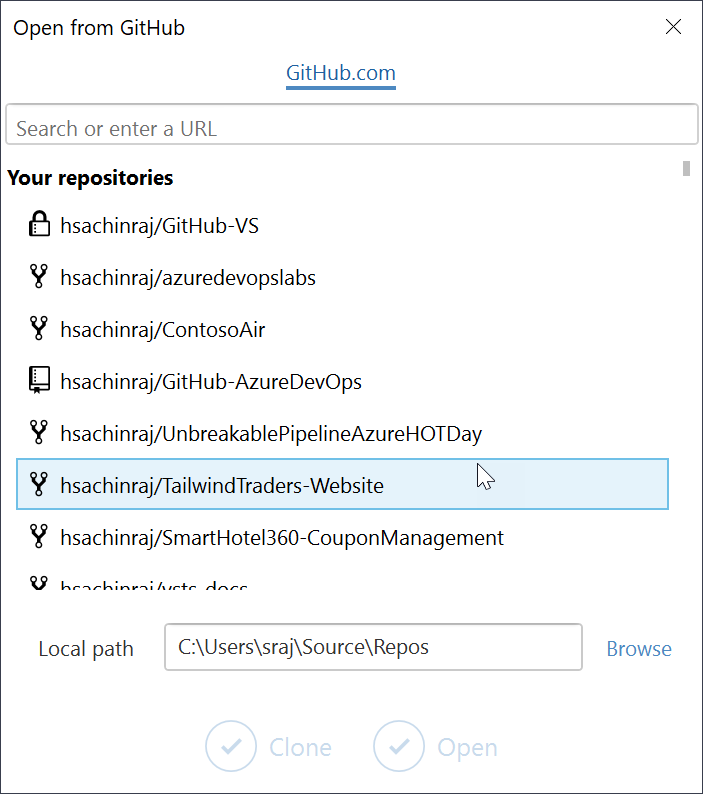

# Modern code flow with GitHub and Visual Studio

**Git** is a modern version control that has won the hearts and minds of developers worldwide to become the first choice for many teams, from small to large enterprises. It is the #1 version control system today and some data sources even claim that it has closer to a 60% market share. 

## So, what's Git?
Unlike the other version control systems such as Subversion, CVS, Team Foundation Version Control, IBM ClearCase which are centralized, Git is a distributed version control system. That means that the code is not just stored on a central server but each developer has a copy of the repository on their local dev machine. Developers can commit each set of changes on their dev machine and perform version control operations such as history and compare without a network connection. This is fundamentally different from the centralized version control system model where historical data is maintained only on the server and without a connection to the server, developers cannot commit changes. 

While the concepts are simple, Git has a high learning curve for developers who are more familiar with the traditional centralized systems. Git has several commands that one must learn to use it. But luckily Visual Studio makes it easy for developers using Visual Studio to integrate and working with Git. VS has a Git client built into the IDE that is supported by a very intuitive user interface which means developers do not have deal with commands to connect and use Git. 

## Why is it successful?
Git has several strengths that contributed to the popularity and the wider adoption - it is free, open, light-weight, distributed, etc., but a top factor for the quick success of Git is GitHub which offers free hosting of Git repos for open source projects.  

## Connecting to a GitHub repository

Ok, let me demonstrate how you use Git. Here, I have Visual Studio 2019 open  on my machine. Right on the startup page, you will notice, you have an option to connect and download code from a GitHub repository.  Visual Studio 2019 is bundled with the  **GitHub extension for Visual Studio** which makes it super easy to work with GitHub. 

I will select the option. In this screen, if I know the address of the repository, I can enter the URL. Otherwise, you can select **Browse**. You will need to Sign-in. You can connect to GitHub or GitHub Enterprise with just a simple username and password instead of having to generate and provide **Personal Access Tokens**. Once connected, the extension automatically detects the repositories you have access to on your account. You can select the repository that you want to connect, from the list and select **clone**. Getting a local copy of a Git repo is called “cloning".  You download the full code from the server to the local machine - so, you will need to specify the local folder you want to use. And that's it - the entire code from the server is downloaded to the local machine.

You can start making changes now and save them. All changes are saved to the local server first - so, you can be offline. When you get online and connect to the remote server , you can then push these changes to the remote. Behind the scene, a number of Git commands have been executed for you - add, commit, stage, push, etc., but that's all simplified for .

 Whenever you add, edit, or delete a file, you're making a commit, and adding them to your branch. Commits also create a transparent history of your work that others can follow to understand what you've done and why. Each commit has an associated commit message, which is a description explaining why a particular change was made. Furthermore, each commit is considered a separate unit of change. This lets you roll back changes.

 When you are back online and ready to push your changes to the remote server, you can select the sync option to push your changes to the server and also retrieve any changes from the remote server. 

## Code flow in GitHub

Another key advantage of Git is the workflow which is branch-based. All changes are saved in branches and reviewed before they are merged. Let me show you that. Assume, I am going to add a new feature to my application which means I need to change code. I will first create a new branch - Unlike centralized version control systems, branches are lightweight and easy to merge. 

Once your branch has been created, you can choose to checkout or switch to the branch. You can confirm it from the status bar below. Now, any changes you make will be within this particular branch. 

Let me add a new line. Save the file, commit and push the changes. Changes you make on a branch don't affect the master branch, so you're free to experiment and commit changes, safe in the knowledge that your branch won't be merged until it's ready to be reviewed by someone you're collaborating with.When you are ready to get feedback on your changes, you create a pull request. You can do this anytime you want -  when you're stuck and need help or advice or when you're ready for someone to review your work. When you create a pull request, you specify a target branch that you want to merge your changes with, and Git will automatically detect the files and changes needed. 

Reviewers can open the pull request, look at the changes and provide their review. The Pull Request Details view shows the current state of the pull request, including:
information about who created the pull request
* the source and target branch
* a description of the pull request (collapsed by default)
* reviewers and the status of their review
* checks (if checks have been enabled for the repository)
*  the files changed

Reviewers can look at the changes, provide their review and approve/reject the changes. I can view this pull request on the GitHub page on Web. Web might be OK if you are viewing some docs or images, but when you are reviewing application code, it may not be super user-friendly. But with the GitHub extension for Visual Studio, you can review the code easily as you will be able to use all your familiar code navigation keys. Comments can be entered at the exact line of code to keep it with the context. These messages will be available to everyone - (switch to web). I can merge my pull request and all changes from my feature branch will now be pushed to the master branch. I can delete my feature branch and then move on to my next feature. 

## Migrating to GitHub 

